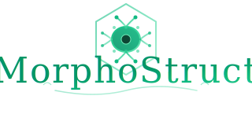

# MorphoStruct

[](https://opensource.org/licenses/MIT)
[](https://www.python.org/downloads/)
[](https://nodejs.org/)

<p align="center">
  
</p>

**MorphoStruct** is an AI-powered scaffold design platform for bioprinting and tissue engineering. Generate anatomically-accurate 3D scaffold geometries with natural language commands or parametric controls, then export print-ready STL files for extrusion-based bioprinting, stereolithography, and other additive manufacturing techniques.

## What It Does

Describe the scaffold you need in plain English:

> "Create a vascular network with 4 inlets, 3 branching levels, and Murray's law optimization for a 10mm diameter disc"

The AI assistant generates the geometry, you preview it in real-time 3D, adjust parameters with sliders, and export to STL.

## Scaffold Library

**39 tissue-specific scaffolds** + **27 geometric primitives** across 9 categories:

| Category | Count | Scaffolds |
|----------|-------|-----------|
| **Primitives** | 27 | Cylinder, Sphere, Box, Cone, Torus, Capsule, Pyramid, Wedge, Prism, Tube, Ellipsoid, Hemisphere, Fillet, Chamfer, Slot, Counterbore, Countersink, Boss, Rib, Branch, Bifurcation, Pore, Channel, Fiber, Membrane, Lattice Cell, Pore Array |
| **Skeletal** | 7 | Trabecular Bone, Osteochondral Interface, Articular Cartilage, Meniscus, Tendon-Ligament, Intervertebral Disc, Haversian Bone |
| **Organ** | 6 | Hepatic Lobule, Cardiac Patch, Kidney Tubule, Lung Alveoli, Pancreatic Islet, Liver Sinusoid |
| **Tubular** | 6 | Blood Vessel, Nerve Conduit, Spinal Cord, Bladder, Trachea, Vascular Perfusion Dish |
| **Soft Tissue** | 4 | Multilayer Skin, Skeletal Muscle, Cornea, Adipose |
| **Vascular** | 3 | Vascular Network, Porous Disc, Tubular Conduit |
| **Dental** | 3 | Dentin-Pulp, Ear Auricle, Nasal Septum |
| **Lattice** | 5 | Gyroid (TPMS), Schwarz-P, Octet Truss, Voronoi, Honeycomb |
| **Microfluidic** | 3 | Organ-on-Chip, Gradient Scaffold, Perfusable Network |

All geometric parameters are validated against published biomaterials literature.

## Key Features

### AI-Assisted Design
Chat interface powered by **Anthropic Claude** or **OpenAI GPT**. Describe what you need, and the assistant generates scaffold parameters, explains design choices, and iterates based on feedback.

### Real-Time 3D Preview
Interactive Three.js viewport with orbit controls. Preview scaffolds instantly before committing to generation. Toggle wireframe view, measure dimensions, and inspect geometry.

### Dynamic Parametric Controls
UI adapts to each scaffold type. The 27 primitive shapes show only relevant dimension sliders. Skeletal scaffolds expose porosity and strut parameters. Vascular networks show branching controls.

### Fast Preview Mode
Generate low-resolution previews in seconds for rapid iteration. Switch to full resolution for final export.

### Invert Geometry
Swap solid and void spaces with one click. Create molds, negative stamps, or inverse scaffolds for casting workflows.

### Performance Optimized
Tree union algorithm provides O(n log n) boolean operations—16x faster than naive approaches for complex scaffolds with hundreds of features.

## Technology Stack

| Layer | Technologies |
|-------|--------------|
| **Frontend** | Next.js 14, React 18, TypeScript, Three.js, Tailwind CSS, Zustand |
| **Backend** | FastAPI, Python 3.10+, Manifold3D, NumPy, Pydantic |
| **AI** | Anthropic Claude API, OpenAI GPT API |
| **Database** | SQLite with SQLAlchemy ORM |
| **Auth** | JWT tokens, bcrypt password hashing |

## Quick Start

```bash
# Clone and install
git clone https://github.com/rsiegemit/MorphoStruct.git
cd MorphoStruct
./morphostruct.sh install

# Start the application
./morphostruct.sh
```

Open http://localhost:3000 in your browser.

### Manual Installation

**Backend:**
```bash
cd backend
python -m venv venv
source venv/bin/activate  # Windows: venv\Scripts\activate
pip install -r requirements.txt
```

**Frontend:**
```bash
cd frontend
npm install
```

## Configuration

Copy the environment template:
```bash
cp backend/.env.example backend/.env
```

Required variables:
```env
ANTHROPIC_API_KEY=sk-ant-...    # For Claude (recommended)
OPENAI_API_KEY=sk-...           # For GPT (alternative)
SECRET_KEY=your-secret-key      # For JWT tokens
```

## Usage

### Starting Servers

```bash
./morphostruct.sh              # Both servers
./morphostruct.sh backend      # API only (port 8000)
./morphostruct.sh frontend     # UI only (port 3000)
```

### API Endpoints

**Generation:**
- `POST /api/generate` — Full scaffold generation with STL
- `POST /api/preview` — Fast preview (lower resolution)
- `POST /api/validate` — Parameter validation
- `GET /api/export/{id}` — Download STL file

**Primitives:**
- `GET /api/primitives/list` — List 27 primitive shapes
- `GET /api/primitives/schema` — Parameter schemas for all primitives
- `GET /api/primitives/schema/{name}` — Schema for specific primitive

**Chat:**
- `POST /api/chat` — Send message to AI assistant

**User Data:**
- `GET /api/scaffolds` — User's saved scaffolds
- `GET /api/presets` — 50+ pre-configured templates

Full API docs: http://localhost:8000/docs

## Project Structure

```
MorphoStruct/
├── backend/
│   └── app/
│       ├── api/                 # REST endpoints
│       ├── geometry/            # Scaffold generators
│       │   ├── primitives/      # 27 geometric primitives
│       │   ├── skeletal/        # Bone & cartilage (7)
│       │   ├── organ/           # Organ-specific (6)
│       │   ├── soft_tissue/     # Skin, muscle (4)
│       │   ├── tubular/         # Vessels, conduits (6)
│       │   ├── dental/          # Dental scaffolds (3)
│       │   ├── lattice/         # TPMS & strut lattices (5)
│       │   └── microfluidic/    # Organ-on-chip (3)
│       ├── llm/                 # AI integration
│       └── models/              # Data models
├── frontend/
│   ├── app/                     # Next.js pages
│   ├── components/
│   │   ├── controls/            # Parameter panels
│   │   ├── viewer/              # 3D viewport
│   │   └── chat/                # AI chat interface
│   └── lib/
│       ├── parameterMeta/       # UI metadata (14 files)
│       └── store/               # State management
├── docs/
│   └── audit/                   # Parameter documentation
├── morphostruct.sh              # Runner script
└── DOCUMENTATION.md             # Technical reference
```

## Scaffold Categories

### Primitives (27 shapes)

Composable building blocks with CSG (Constructive Solid Geometry) support:

| Category | Shapes |
|----------|--------|
| **Basic** | Cylinder, Sphere, Box, Cone |
| **Geometric** | Torus, Capsule, Pyramid, Wedge, Prism, Tube, Ellipsoid, Hemisphere |
| **Architectural** | Fillet, Chamfer, Slot, Counterbore, Countersink, Boss, Rib |
| **Organic** | Branch, Bifurcation, Pore, Channel, Fiber, Membrane, Lattice Cell, Pore Array |

### Skeletal Tissue (7 types)

Bone and cartilage scaffolds with anatomically-accurate microarchitecture:
- **Trabecular Bone** — Porous strut network mimicking cancellous bone
- **Osteochondral** — Gradient interface between bone and cartilage
- **Articular Cartilage** — Zonal architecture (superficial, middle, deep)
- **Meniscus** — C-shaped fibrocartilage with radial zones
- **Tendon-Ligament** — Aligned crimped fiber bundles
- **Intervertebral Disc** — Nucleus pulposus + annulus fibrosus layers
- **Haversian Bone** — Osteons with central Haversian canals

### Organ-Specific (6 types)

Tissue-specific microarchitectures:
- **Hepatic Lobule** — Hexagonal liver functional unit
- **Cardiac Patch** — Aligned myocardial fibers
- **Kidney Tubule** — Proximal tubule with convolutions
- **Lung Alveoli** — Branching respiratory tree
- **Pancreatic Islet** — Endocrine cell clusters
- **Liver Sinusoid** — Fenestrated capillary network

### Advanced Lattices (5 types)

TPMS (Triply Periodic Minimal Surfaces) and strut-based lattices:
- **Gyroid** — Smooth minimal surface, high interconnectivity
- **Schwarz-P** — Cubic symmetry minimal surface
- **Octet Truss** — High strength-to-weight ratio
- **Voronoi** — Organic-looking random cells
- **Honeycomb** — Hexagonal prismatic cells

### Microfluidic (3 types)

Lab-on-chip and perfusion scaffolds:
- **Organ-on-Chip** — Multi-chamber microfluidic device
- **Gradient Scaffold** — Pore size or porosity gradients
- **Perfusable Network** — Murray's law optimized branching

## Technical Details

### Murray's Law
Vascular networks use Murray's law for optimal branching: the cube of the parent vessel diameter equals the sum of cubes of child diameters. This minimizes metabolic energy while maximizing nutrient transport.

### TPMS Surfaces
Gyroid and Schwarz-P scaffolds are triply periodic minimal surfaces with zero mean curvature. They provide high surface area (100-300 m²/cm³), ~50% porosity, and smooth interconnected pore networks ideal for cell infiltration.

### CSG Tree Evaluation
Primitives can be combined using boolean operations (union, difference, intersection) defined in JSON syntax. The AI assistant can generate complex composite geometries from natural language descriptions.

## Documentation

- **[DOCUMENTATION.md](DOCUMENTATION.md)** — Comprehensive technical reference
- **[docs/audit/](docs/audit/)** — Parameter documentation for all scaffold types

## Contributing

Contributions welcome. Please open an issue to discuss changes before submitting a pull request.

## License

MIT License — see [LICENSE](LICENSE) for details.

## Acknowledgments

Scaffold geometries based on published biomaterials literature. Parameter ranges validated against peer-reviewed tissue engineering research.
